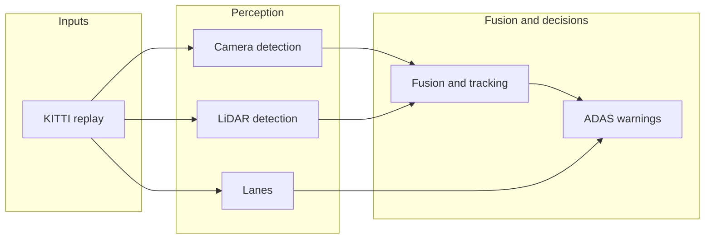

# MOSAIC

**Multi-Object Sensor Fusion and Intelligent Classification** — a ROS 2 driving stack that combines **camera** and **LiDAR**, **fuses** what they see into **tracks over time**, and adds **lane** context plus **ADAS-style warnings** (e.g. forward closing, lane departure). It replays the **KITTI** dataset so you can run the same pipeline again and again.

### Demo video


[](https://youtu.be/mJqeR_JMt8g)

**Direct link:** [https://youtu.be/mJqeR_JMt8g](https://youtu.be/mJqeR_JMt8g)

---

## What it does 

1. **Replay** synced camera images and LiDAR from KITTI.  
2. **Detect** objects from the camera (YOLO) and from the LiDAR (clustering).  
3. **Fuse** those detections into **persistent tracks** (same object, stable ID, updated state).  
4. **Estimate lanes** from the image (simple classical vision → JSON).  
5. **Emit warnings** from tracks + lanes (structured messages you can log or visualize).

---

## Architecture (high level)



Topics and timing details: [`docs/architecture.md`](docs/architecture.md).

---

## Tech stack

| Area | Choice |
|------|--------|
| Middleware | **ROS 2 Humble** |
| OS / dev | **Ubuntu 22.04** in **Docker** |
| Languages | **Python** (replay, camera, lanes) · **C++17** (LiDAR, fusion, ADAS) |
| Libraries | **Eigen**, **OpenCV**, **PCL**-style LiDAR pipeline, **Ultralytics YOLO** |
| Viz | **Foxglove Studio** (optional WebSocket bridge) |

---

## Quick start

**Host (repo root):** start the dev container, then open a shell inside it.

```bash
docker compose -f docker/compose.yaml up --build -d
docker compose -f docker/compose.yaml exec mosaic-dev bash
```

*(Same thing from the `docker/` folder: `docker compose up --build -d` then `docker compose exec mosaic-dev bash`.)*

**Inside the container:** build once, then launch (put KITTI under `data/kitti` on the host so it appears as `/workspace/data/kitti`).

```bash
source /opt/ros/humble/setup.bash
cd /workspace/ros2_ws && colcon build --merge-install && source install/setup.bash
ros2 launch mosaic_bringup mosaic_pipeline.launch.py \
  dataset_root:=/workspace/data/kitti sequence:=0 launch_foxglove_bridge:=true
```

**Foxglove (on your Mac):** connect to **`ws://localhost:8765`**, then add panels for `/mosaic/camera/image_raw`, `/mosaic/lidar/points`, etc.

---

## More documentation

| Doc | Contents |
|-----|----------|
| [**Developer guide**](docs/developer-guide.md) | Repo layout, Docker detail, Foxglove troubleshooting, bags, metrics, KITTI eval, tuning tables |
| [**Architecture**](docs/architecture.md) | Topic list, replay timing vs async fusion |
| [**Roadmap**](docs/roadmap.md) | Demo vs research vs product scope |
| [**Production**](docs/production.md) | What a real program still needs beyond this repo |